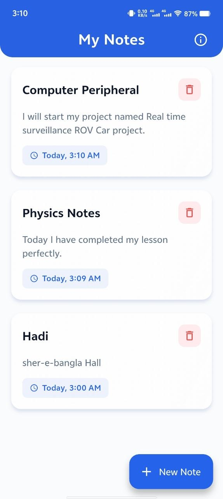
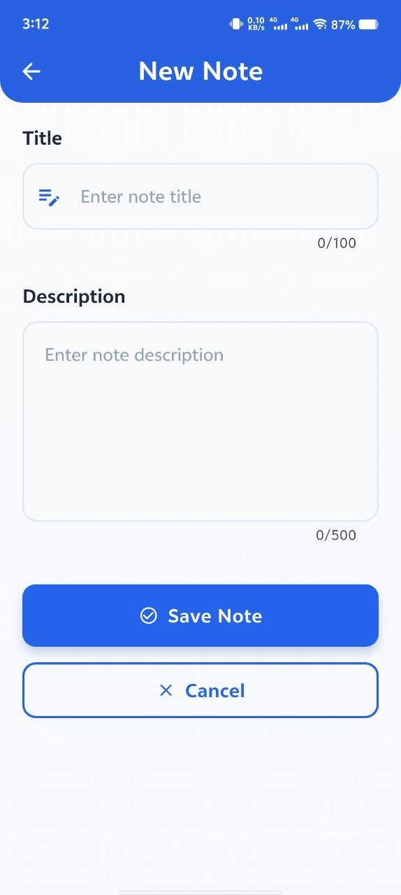
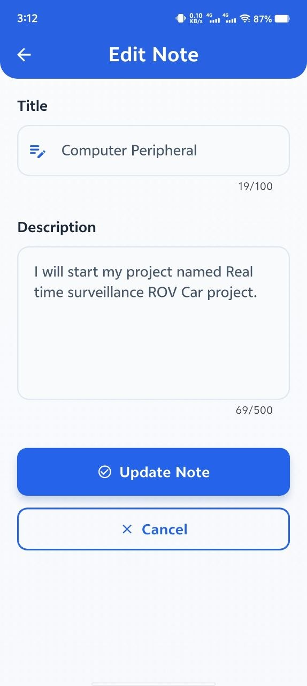
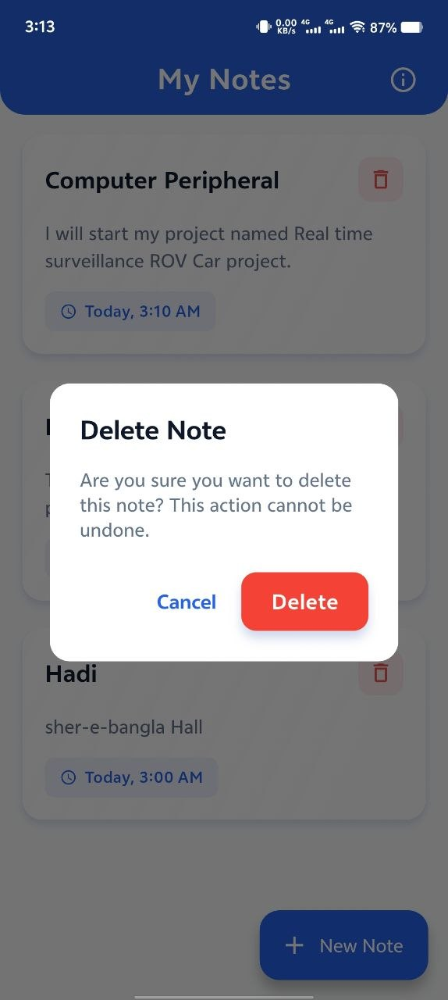
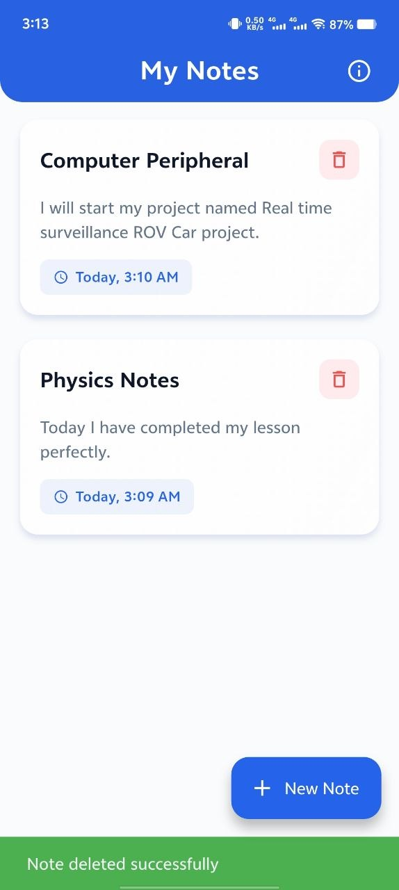
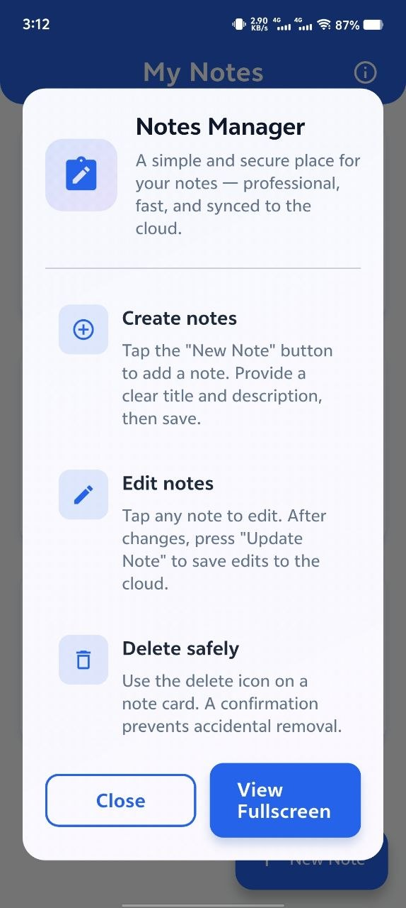
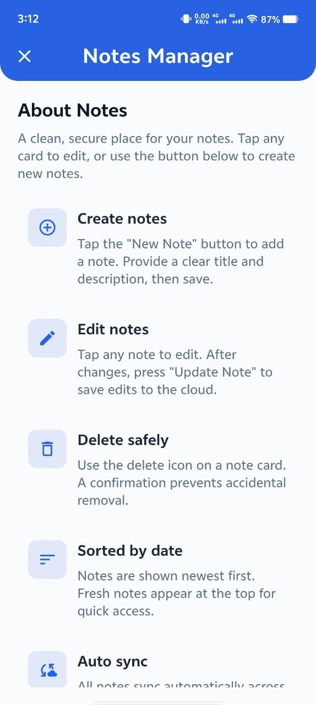

# Notes Management App

A professional, beginner-friendly Flutter application for creating, viewing, updating, and deleting notes using Cloud Firestore. This repository implements a complete CRUD flow and demonstrates a practical integration between Flutter and Firebase suitable for coursework or a portfolio project.

---

## Project Overview

This app implements a simple Notes Management Application that satisfies the assignment requirements:

- Create Note: Add a new note with a title and description.
- View Notes: See all saved notes in a list view.
- Update Note: Edit an existing note and save changes.
- Delete Note: Remove a note with a confirmation dialog.

The app provides a clean, modern UI built with Material 3 and a premium color palette, plus smooth UX touches like animated note cards and polished dialogs.

---

## Features

- Create, read, update, delete (CRUD) notes
- Notes stored in Cloud Firestore as top-level documents with a `userId` field
- Anonymous Firebase Authentication to associate notes with a user
- Client-side sorting by date (newest first)
- Robust Firestore security rules restricting access to authenticated users and enforcing ownership
- Centralized theme and premium UI components (gradient backgrounds, elevated cards, interactive buttons)
- Responsive layouts and an optional full-screen "About / Info" page

---

## Tech Stack & Dependencies

- Flutter (stable)
- Firebase
  - cloud_firestore: ^6.6.0
  - firebase_core: ^4.11.0
  - firebase_auth: ^4.6.0
- intl: ^0.20.3 (date formatting)

See `pubspec.yaml` for exact dependency versions.

---

## Project Structure (key files)

- `lib/main.dart` — app entry point; initializes Firebase and anonymous auth
- `lib/theme/app_theme.dart` — centralized Material 3 theme and color system
- `lib/models/note.dart` — `Note` data model (includes `userId`, `title`, `description`, `createdAt`, `updatedAt`)
- `lib/services/note_service.dart` — Firestore data access (queries filtered by `userId`)
- `lib/screens/notes_list_screen.dart` — main list of notes with actions and info dialog
- `lib/screens/add_edit_note_screen.dart` — create/edit note form
- `lib/widgets/note_card.dart` — animated note card UI with edit/delete
- `lib/widgets/empty_state.dart` — polished empty-state component
- `firestore.rules` — Firestore security rules enforcing auth and ownership
- `firestore.indexes.json` — composite index config (if used)
- `firebase.json` — Firebase CLI config for rules and indexes
- `lib/firebase_options.dart` — generated Firebase configuration file

---


# Project UI 


<p align="center">
	
	&nbsp;&nbsp;&nbsp;
	
	&nbsp;&nbsp;&nbsp;
	
	&nbsp;&nbsp;&nbsp;
	
	&nbsp;&nbsp;&nbsp;
	
	&nbsp;&nbsp;&nbsp;
	
	&nbsp;&nbsp;&nbsp;
	
	&nbsp;&nbsp;&nbsp;
	

  
</p>

## Firebase Setup (quick)

1. Create a Firebase project (project used: `notemanagement-2e014` in development).
2. Enable **Authentication** and add **Anonymous** sign-in (used by the app to associate notes).
3. Enable **Cloud Firestore** and set up a production or test database.
4. Add your Firebase app configuration (web/android/ios) and run `flutterfire configure` to generate `lib/firebase_options.dart`.
5. Deploy security rules and indexes from the repository root (optional but recommended):

```bash
firebase deploy --only firestore:rules --project <your-project-id>
firebase deploy --only firestore:indexes --project <your-project-id>
```

Note: `firestore.rules` in this repo enforces `request.auth != null` and ensures `resource.data.userId == request.auth.uid` for reads/updates/deletes.

---

## Running the App

1. Install dependencies:

```bash
flutter pub get
```

2. Connect a device or start an emulator and run:

```bash
flutter run
```

If you need platform-specific setup (Android/iOS), follow the standard Flutter documentation for platform config and make sure `google-services.json` (Android) or `GoogleService-Info.plist` (iOS) are present in the platform folders.

---

## Usage

- Tap **New Note** (floating button) to create a note. Fill in title and description, then tap `Save Note`.
- Tap any note card to open the editor. Edit fields and tap `Update Note` to save.
- Use the delete icon on a note card to remove a note; a confirmation dialog protects against accidental deletion.
- Open the info icon in the app bar for a branded, full-screen help page.

---

## Security & Data Model

- Notes are stored as documents under the `notes` collection. Each note document includes a `userId` field.
- Security rules restrict access so users can only read and modify documents where `note.userId == request.auth.uid`.
- The app signs users in anonymously; for production apps, replace anonymous with proper user auth.

---

## Design Notes

- Premium color palette: primary `#2563EB`, secondary `#7C3AED`, accent `#06B6D4`.
- Centralized theming via `AppTheme` ensures consistent, professional visuals across screens.
- Interactive elements: animated note cards (hover/press scale), gradient dialogs, and staggered list animations.

---

## Testing & Validation

- Basic static analysis was run during development (`flutter analyze`).
- Verify Firestore rules by attempting CRUD operations with authenticated/unauthenticated contexts.
- Recommended manual tests: create, update, delete notes; verify data stored under `notes` with `userId`; ensure unauthorized access is blocked.

---

## Notes for Submission

- Create a public GitHub repository and push the project root. Include this `README.md` in the repository root.
- If required, include a short video or screenshots showing the app creating, editing, and deleting a note.

---

## License & Credits

This sample project is provided for learning and coursework purposes. Feel free to adapt, extend, or refactor for production use. Credit to the student author for implementing this app.

---

If you want, I can also:

- Add a `screenshots/` folder with ready-made device screenshots for your GitHub README.
- Tidy remaining deprecation warnings (`withOpacity` → `withValues`).

Would you like either of those next?
